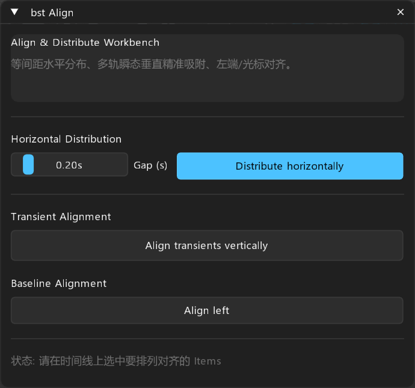

# bst: Align — 音效对齐与排版工作台

> **定位**: 音频时间线等间距分布与跨轨瞬态垂直吸附排版工作台

---

## 面板预览

---

## 1. 核心概述

音效师在 Arrange 视图排布数十个脚步声、受击变奏或多层分轨素材时，常常需要繁琐的手工对齐。`bst Align` 提供了高精度的布局工具：
1. **水平等间距分布**: 按照自定义的 Gap 秒数（如 0.2s），将选中的所有 Items 依次自动紧密排布。
2. **瞬态垂直吸附对齐**: 分析各轨道上每个 Item 的真实起音 RMS 峰值，将其 Snap Offset 精确对齐到垂直同一参考线上，确保分层打击完全同步重合。
3. **左端基准对齐**: 将所有选中 Item 的起始点对齐到当前编辑光标或首个 Item。

---

## 2. 操作按钮

- **Distribute horizontally**: 按照指定的 Gap (s) 间隔时长，首尾相接地整齐横向排布。
- **Align transients vertically**: 以第 1 个条目为准，将其余跨轨条目瞬态垂直对齐到同一时刻。
- **Align left**: 全部左对齐到光标或首条目起点。
