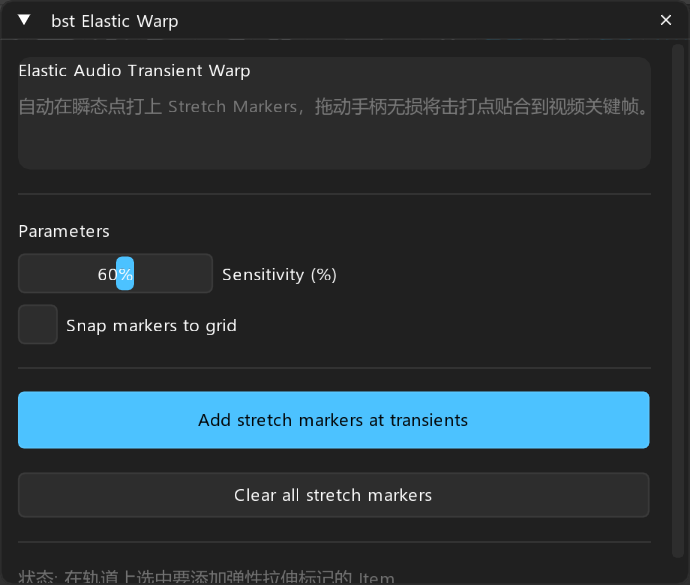

# bst: Elastic Warp — 弹性音频瞬态对齐

> **对标**: `Sexan Warp` / `Pro Tools Elastic Audio`  
> **定位**: 瞬态点自动打 Stretch Markers，支持拖动手柄自由贴合格点或视频打击点

---

## 面板预览

---

## 1. 核心概述

制作 CG 动作片、过场动画音效或节奏性声效时，经常需要将声音的撞击瞬间拉伸对准画面中的刀刃触碰点或重击帧。`bst Elastic Warp` 自动分析音频波形中的起音瞬态并在 Take 内部写入 Stretch Markers（拉伸标记），音效师只需在 Arrange 窗口中拖动标记手柄，即可像玩橡皮筋一样无损拉伸音频起落时间，而不改变采样音质。

---

## 2. 参数与控件说明

- **Sensitivity (%)**: 瞬态检测敏感度调节。
- **Snap markers to grid**: 标记点自动吸附到时间线节拍网格。

---

## 3. 操作按钮

- **Add stretch markers at transients**: 一键在瞬态点添加 Stretch Markers 手柄。
- **Clear all stretch markers**: 一键移除选中条目的所有拉伸标记还原原始采样。
