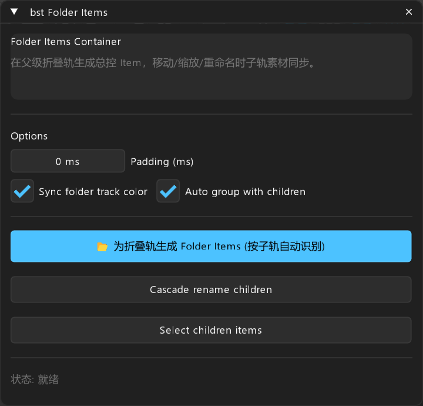

# bst: Folder Items — 折叠轨容器管理

> **对标**: `nvk_FOLDER_ITEMS`  
> **定位**: 父折叠轨总控容器条目、子轨素材联动与级联重命名

---

## 面板预览

---

## 1. 核心概述

在 REAPER 中，子轨道的素材虽归属于父折叠轨（Folder Track），但移动、复制、重命名父轨时子轨素材无法直观联动。`bst Folder Items` 通过在父折叠轨上智能分析子轨音频片段并创建等宽的“母控容器条目”（Folder Items），让多层音效作为一个整体被管理。

---

## 2. 参数与控件说明

- **Padding (ms)**: 为母控容器条目提供前后安全时间边缘缓冲。
- **Sync folder track color**: 自动将父折叠轨的颜色同步赋予生成的 Folder Item。
- **Auto group with children**: 生成时自动将 Folder Item 与其包含的所有子轨 Items 绑定为同一 Group，移动母块即同步移动所有子层。

---

## 3. 操作按钮

- **Create folder items**: 自动检测折叠轨下方所有子轨道的 Item 分布，将时间紧密或重叠的子轨素材聚类为一个声音事件块，在父折叠轨生成等宽总控条目。
- **Cascade rename children**: 选中折叠轨上的 Folder Item（如命为 `SFX_Skill_Cast`），点击级联重命名，所有子轨对应素材自动命名为 `SFX_Skill_Cast_轨道名`。
- **Select children items**: 选中 Folder Item 点击按钮可瞬时点选所有隶属的子轨素材。
