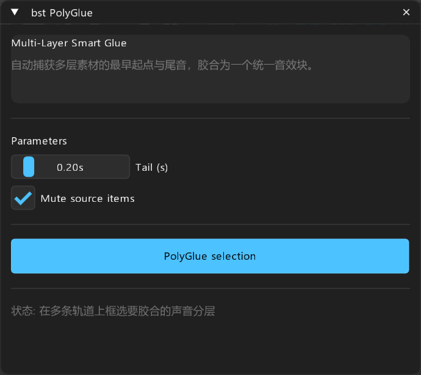

# bst: PolyGlue — 跨轨多层智能胶合工作台

> **对标**: `LKC PolyGlue`  
> **定位**: 跨多条轨道将分散的复合声音碎片一键胶合为单一整体条目

---

## 面板预览

---

## 1. 核心概述

声音设计通常涉及 3~5 轨甚至十余轨碎片素材（Click + Body + Sub + Reverb Tail）。当要在主工程中移动或排版这些复合声音时，传统做法要么打组（极易误操作散架），要么必须手动框选时间线逐个 Render/Glue。`bst PolyGlue` 一键侦测跨轨素材的总起止范围，自动扩展尾音缓冲，并将它们整齐胶合为一个完整的复合条目，同时支持一键静音源分层。

---

## 2. 参数与控件说明

- **Tail (s)**: 为残响/混响尾音保留安全时长（默认 0.2s）。
- **Mute source items**: 胶合完成后自动将原分层素材静音保留，随时可以回退修改。

---

## 3. 操作按钮

- **PolyGlue selection**: 自动识别跨轨素材边界，一键智能胶合为单一复合条目。
