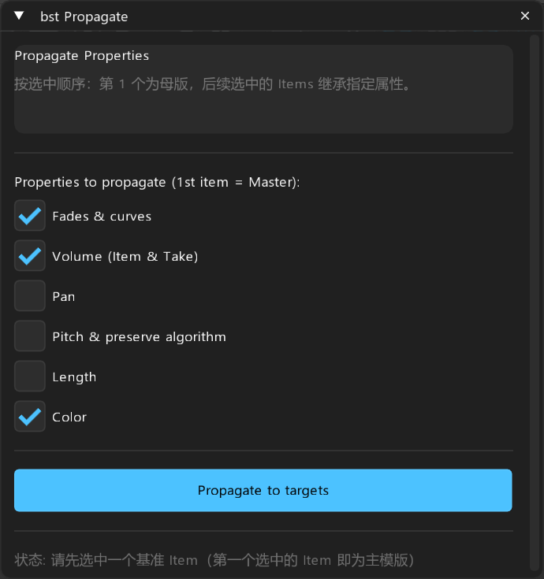

# bst: Propagate — 变奏属性广播同步

> **对标**: `nvk_PROPAGATE`  
> **定位**: 将基准母版的修剪、淡变、音量、音高与色彩一键同步至批处理目标

---

## 面板预览

---

## 1. 核心概述

当为同一类声音（如 10 个不同的重击变奏）调整好第 1 个样本的淡入淡出曲线、音量平衡、音高算法和裁剪长度后，音效师无需逐个复制粘贴属性。`bst Propagate` 将首个选中的 Item 视为基准母版（Master），将其属性瞬时广播同步到后续选中的所有目标 Items。

---

## 2. 属性项选择

- **Fades & curves**: 严格复制 Fade In / Fade Out 长度及曲率（Shape 0~6）。
- **Volume (Item & Take)**: 同步条目增益与活动 Take 增益。
- **Pan**: 同步声像设置。
- **Pitch & preserve algorithm**: 同步半音偏移与保留音高开关。
- **Length**: 强制将目标条目裁剪为与母版一致的长度。
- **Color**: 同步视觉分组颜色。

---

## 3. 操作按钮

- **Propagate to targets**: 立即将母版属性广播同步到其余选中 Item。
