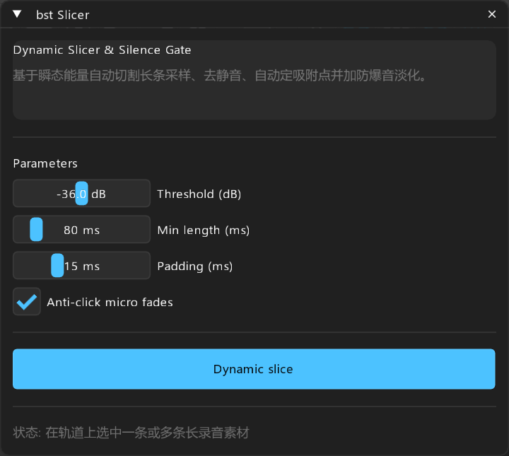

# bst: Slicer — 瞬态智能批量切片与去静音

> **对标**: `X-Raym Dynamic Split` / `nvk_ITEMS`  
> **定位**: 录音长采样无破音自动化切片、去静音门限过滤与自动打吸附点

---

## 面板预览

---

## 1. 核心概述

录音棚拟音（Foley）、实录拟音素材往往是一段长达数分钟的音频，包含数十次道具敲击或挥舞。`bst Slicer` 基于瞬态峰值与静音阈值门限，自动将长录音切成干净的独立 Item，自动剔除无效静音段，并自动为每个切片添加 3ms 起落微淡化消除爆音，同时将每个片段的 Snap Offset 精准打在起音峰值上。

---

## 2. 参数与控件说明

- **Threshold (dB)**: 判定声音事件开始的瞬态振幅门限（-60dB ~ -12dB）。
- **Min length (ms)**: 过滤掉短于此门限的杂音或误触碎块。
- **Padding (ms)**: 在起音前保留微小的自然时间余量。
- **Anti-click micro fades**: 自动为切断处追加起落微淡化防爆音。

---

## 3. 操作按钮

- **Dynamic slice**: 执行智能批量切片与吸附点自动标定。
