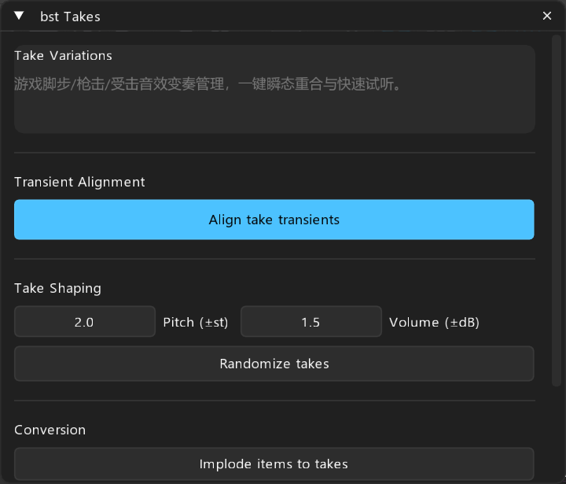

# bst: Takes — 多 Take 变奏管理

> **对标**: `nvk_TAKES`  
> **定位**: 游戏音效多 Take 瞬态重合对齐、多轨合并/拆解与批量变奏微调

---

## 面板预览

---

## 1. 核心概述

制作受击声、枪击声、脚步声等高频重复的声音时，音效师常将多个变奏存储在单个 Item 的多个 Takes 中。`bst Takes` 解决了多 Take 之间起音点不一致导致切换时“打架”、以及多轨素材与 Takes 相互转换的繁琐痛点。

---

## 2. 参数与控件说明

- **Transient Alignment**:
  - 逐一分析 Item 内部每个 Take 的起音 RMS 峰值，自动平移各 Take 的 `D_STARTOFFS`，使切换任何 Take 时打击瞬间完全重叠，瞬态凝聚度 100%。
- **Take Shaping**:
  - **Pitch (±st)**: 批量对选中 Item 内部所有 Takes 进行随机音高微调。
  - **Volume (±dB)**: 随机音量增益浮动。

---

## 3. 操作按钮

- **Align take transients**: 一键对齐选中 Item 内部所有 Take 的起音瞬态（RMS Peak）。
- **Randomize takes**: 为选中 Item 的所有 Take 施加随机音高/音量变奏。
- **Implode items to takes**: 将选中的多个 Items 压缩合并为一个 Item 的多个 Takes。
- **Explode takes to tracks**: 将选中条目的所有 Takes 展开拆解为纵向独立平行轨道。
