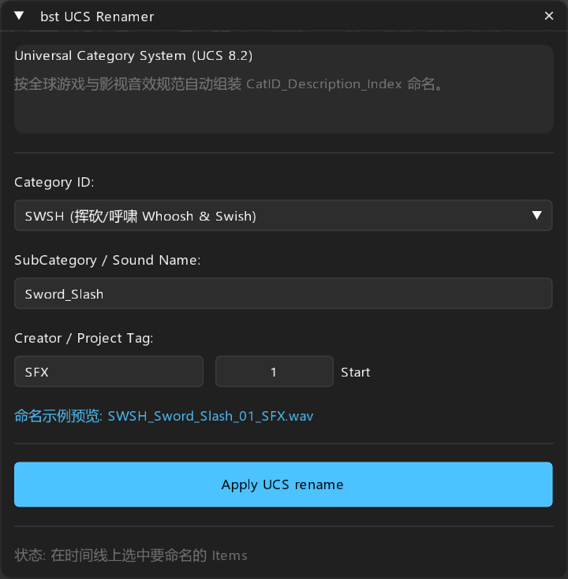

# bst: UCS Renamer — 工业级音效分类命名

> **定位**: 遵循全球 Universal Category System (UCS 8.2) 标准的游戏音效快速命名面板

---

## 面板预览

---

## 1. 核心概述

UCS (Universal Category System) 是现代游戏与影视声音工业界的事实标准（Boom Library、Soundminer、Wwise 均深度适配）。规范格式为：`CatID_SubCategory_Index_Vendor`。
`bst UCS Renamer` 提供了游戏音效高频大类分类选择器，配合智能递增序号与项目标签，实现一键标准化重命名。

---

## 2. 参数与大类支持

- **Category ID**:
  - `SWSH`: 挥砍、破空、呼啸 (Whooshes & Swishes)
  - `IMPT`: 击打、碰撞、受击 (Impacts & Hits)
  - `EXPL`: 爆炸、崩塌、冲击波 (Explosions)
  - `MGIC`: 魔法、神圣、暗影、能量 (Magic & Spells)
  - `FOOT`: 脚步、走跑、跳落 (Footsteps)
  - `CREA`: 怪物、野兽、呼哧、咆哮 (Creatures)
  - `MECH`: 机械、齿轮、机关、金属 (Mechanical)
  - `WEAP`: 武器、枪械、上膛、弹壳 (Weapons & Guns)
  - `UI`: 界面、按钮、结算、提示 (User Interface)
  - `SCIF`: 科幻、激光、跃迁 (Sci-Fi)
- **SubCategory / Sound Name**: 子类与音效具体描述（如 `Sword_Slash`）。
- **Creator / Project Tag**: 创作者或项目代号标签。
- **Start #**: 自增序号起始编号。
- **Preview**: 实时命名示例预览。

---

## 3. 操作按钮

- **Apply UCS rename**: 一键将选中的所有 Items 批量格式化命名。
