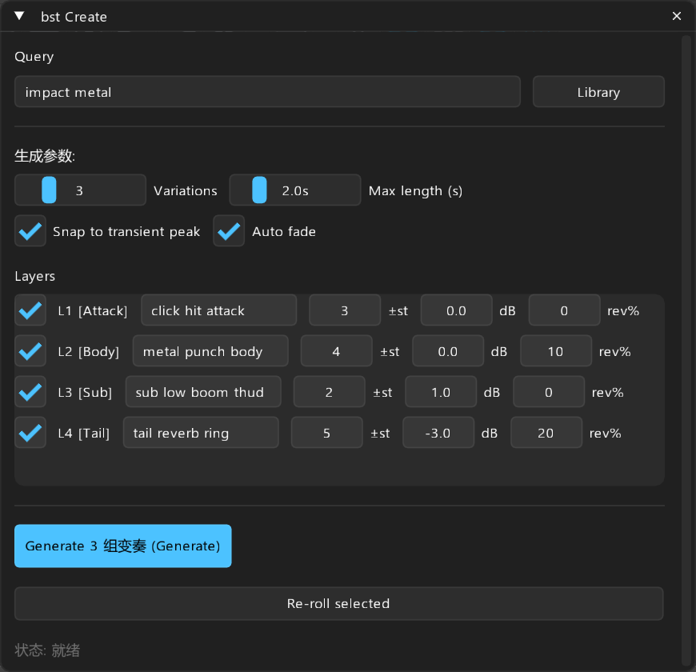
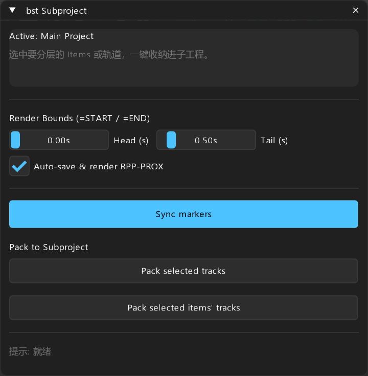
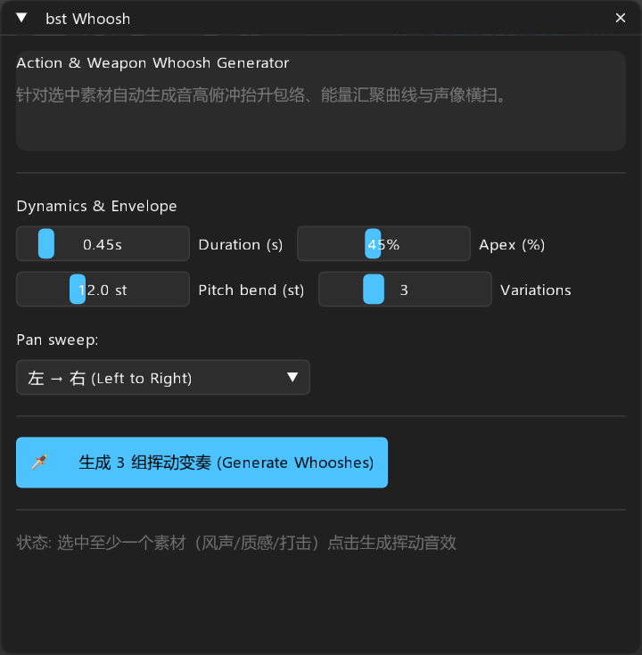
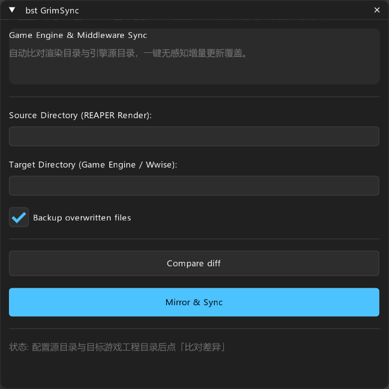
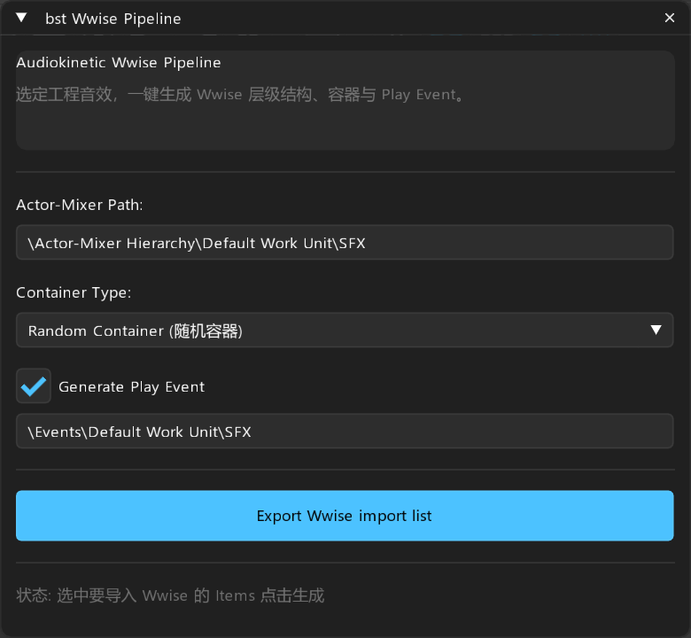

> **[中文](README_CN.md)** | English

# bst-reascripts

Game audio & sound design scripts for REAPER with Fluent 2 UI.

Inspired by professional workflows from nvk, LKC, X-Raym, and Sexan.

## Installation

### Via ReaPack (Recommended)

1. Open REAPER
2. Go to **Extensions → ReaPack → Import repositories**
3. Copy and paste this URL:

```
https://raw.githubusercontent.com/bpmstall/bst-reascripts/main/index.xml
```

4. Click OK, then go to **Extensions → ReaPack → Browse packages**
5. Search for "bst" to see all available scripts
6. **Important**: Install `bst_lib.lua` and `bst_fluent.lua` first (required dependencies)
7. Find scripts in REAPER action list by searching "bst" or "Custom: bst"

### Troubleshooting

If you get "could not fetch repository" error:

- Make sure you're using the **raw.githubusercontent.com** URL above (not the github.com page URL)
- Check your internet connection allows access to raw.githubusercontent.com
- Try adding the repository manually: Extensions → ReaPack → Manage repositories → Add
- In China: If raw.githubusercontent.com is blocked, consider using a VPN or proxy

### Requirements

- REAPER 7+
- [ReaImGui extension](https://forum.cockos.com/showthread.php?t=250419) v0.10+ (install via ReaPack default repositories)

## Scripts

### Layer Design & Generation
- **bst Create** - Multi-layer sound design with library search, transient alignment, and variation generation
- **bst Whoosh** - Action whoosh generator with pitch bend automation and pan sweep

### Project Organization  
- **bst Subproject** - Pack tracks into subprojects with auto marker alignment
- **bst Folder Items** - Container items for folder tracks with cascade renaming
- **bst Takes** - Align take transients, implode/explode conversion

### Editing & Alignment
- **bst Align** - Distribute items horizontally or align transients vertically
- **bst Propagate** - Copy fades, volume, pan, pitch from master to targets
- **bst Elastic Warp** - Add stretch markers at transients for elastic audio

### Processing & Slicing
- **bst Slicer** - Dynamic split long recordings with transient detection
- **bst PolyGlue** - Glue multi-track layers into single items
- **bst Loopmaker** - Create seamless loops with crossfades
- **bst Variations** - Batch randomize pitch, volume, pan

### Game Audio Pipeline
- **bst GrimSync** - Sync rendered audio to game engine/Wwise directories
- **bst Wwise Pipeline** - Generate Wwise import lists and containers
- **bst UCS Renamer** - Batch rename with UCS 8.2 standard

### Utilities
- **bst Search Palette** - Quick launcher for tracks, items, markers, FX, scripts
- **bst SD Toolbox** - All-in-one sound design panel
- **bst Clipboard Manager** - Visual clipboard with waveform preview
- **bst Render Blocks** - Manage render regions with metadata
- **bst Auto Doppler** - Auto-write doppler automation from RMS peaks

## Documentation

Each script has detailed documentation in the [`Docs/`](Docs/) folder with screenshots.

## Screenshots

| bst Create | bst Subproject |
|:---:|:---:|
|  |  |

| bst Whoosh | bst Align |
|:---:|:---:|
|  |  |

| bst GrimSync | bst Wwise Pipeline |
|:---:|:---:|
|  |  |

## Support

Report issues: [GitHub Issues](https://github.com/bpmstall/bst-reascripts/issues)

REAPER Forum: [Cockos REAPER Forums](https://forum.cockos.com)

## License

Scripts provided for personal and commercial use.
