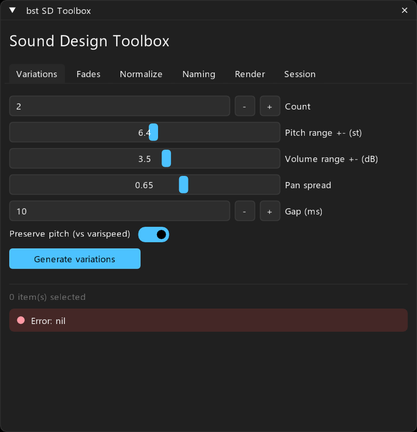
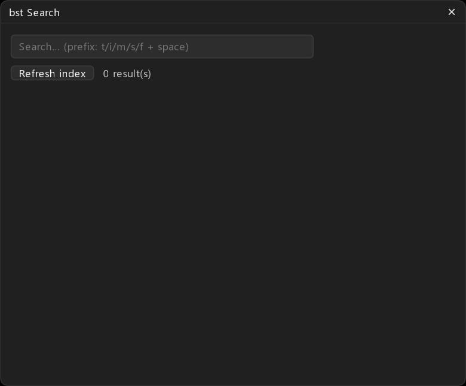
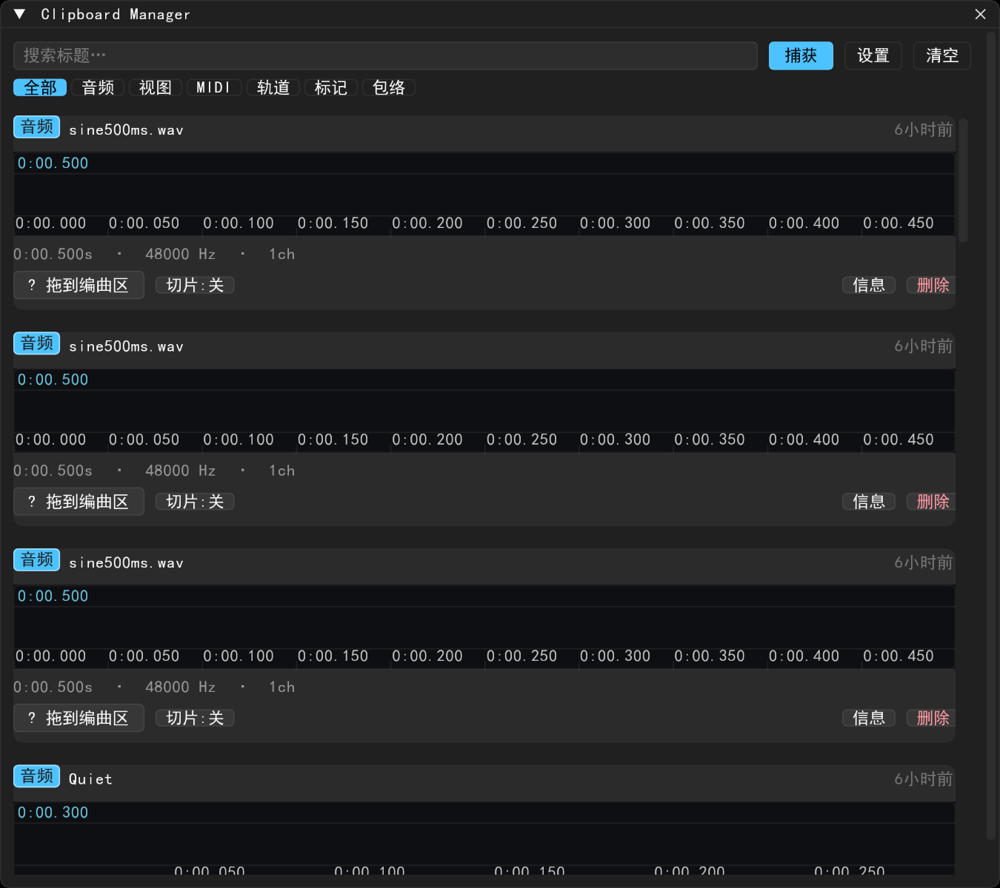

# bst ReaScripts

游戏音频 / 音效设计向的 REAPER 脚本套件(前缀 `bst`),Fluent UI 风格,支持通过
**ReaPack** 一键安装与更新。

## 面板预览







两组脚本:

| 分类 | 内容 |
| --- | --- |
| BST Sound Tools | 声音设计工具箱、搜索面板、零交叉裁剪循环、**循环生成器 (Loopmaker)**、**自动多普勒 (Auto Doppler + 配套 JSFX)**、变奏工作台、渲染块、批量渲染、归一化、take 重命名等 13 个文件(含共享库 `bst_lib.lua` / `bst_fluent.lua` 与 `Effects/bst/bst_Doppler.jsfx`) |
| BST Clipboard | 剪贴板管理器:捕获 item/轨道/标记/包络/MIDI → 波形预览选区切片 → 拖出粘贴,共 11 个文件 |

### 循环生成器 bst: Loopmaker

选中音频 item → 面板里「生成循环」:按零交叉对齐 + 头尾交叉淡化,批量产出
真正的无缝循环 item(自动开启循环源),支持时选拟定循环长度、每循环随机取
内容窗做变奏、整秒对齐、前后缀编号命名、空格试听。渲染的 WAV 落在
`<工程媒体目录>/bst_loops/`。

### 自动多普勒 bst: Auto Doppler

选中轨道(可框选时选限制范围)→「写入自动化」:分析轨道上每个 item 的
RMS 峰值时刻、把 item 吸附偏移标到峰值,再给配套 JSFX「bst Doppler」的
路径位置参数写包络,让声源恰好在峰值均值时刻经过听者(声像/距离/音高
联动)。也可切换「自定义 FX 参数」给任意已装多普勒插件的参数写同类包络。
JSFX 会随 ReaPack 安装到 `Effects/bst/`;若添加 FX 失败,重启 REAPER
让其扫描一次即可。

## 通过 ReaPack 安装

1. REAPER 菜单 `Extensions > ReaPack > Manage repositories…`
2. 点 `Add`,填入本仓库索引地址:

   ```
   https://github.com/bpmstall/bst-reascripts/raw/main/index.xml
   ```
   (国内网络若拉不到 raw.githubusercontent.com,可用上面的 github.com/raw 形式,二者等价)

3. `Extensions > ReaPack > Browse packages`,按分类整组安装
   (BST Sound Tools 内的 `bst_lib` / `bst_fluent` 是必需依赖)。
4. 安装后动作列表搜 `bst:` 即可。

## 必做:把「智能复制」绑到 Ctrl+C

剪贴板历史是靠智能捕获填充的——为此需要让 **bst: Copy (Smart)** 成为一个
常用快捷键动作:

1. 打开 Actions(Local or Global):`Actions > Show action list…`
2. 搜索 `bst Copy (Smart)`(即「智能复制:按上下文复制 item/轨道/时间线并自动入历史」)
3. 选中后在 **Shortcut for selected action** 里按 `Ctrl+C` 绑定。
4. 之后在 arrange 里 `Ctrl+C` 即会复制并自动把内容送进剪贴板管理器历史,
   再在主面板里预览/切片/拖出粘贴。

> 原版 OxTools 用户升级过来时,`Ctrl+C` 绑定会随 RS 动作 ID 原样保留,无需重绑。

## 环境要求

- REAPER 7+、[ReaImGui](https://reapack.com) 扩展(0.10+)
- 首次运行若缺 ReaImGui,脚本会弹出中文安装指引
- SWS 可选(拖出落点跟随鼠标时需要)
- 设置存于 ExtState 段 `OxTools`(工具)与 `CBM` / `CBM_UI`(剪贴板),从旧版 OxTools 升级无需重配

## 本地开发

- 真源码目录:`%APPDATA%\REAPER\Scripts\bst`(工具)与 `%APPDATA%\REAPER\Scripts\CBM`(剪贴板)
- 本仓库内容与其保持一致;改动后重新拷贝并提交即可

## 发布新版本

1. 改完脚本后,在 `index.xml` 对应 `<reapack>` 里追加一个更高版本号的
   `<version>` 块(URL 不变),ReaPack 会自动提示用户升级
2. `git add -A && git commit -m "..." && git push`
